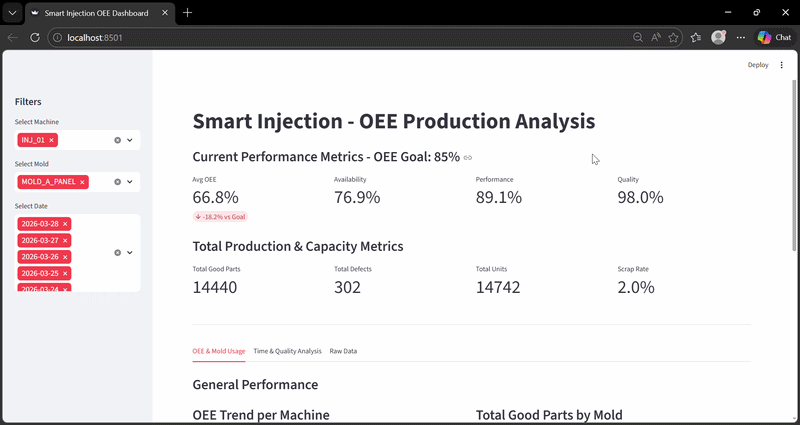
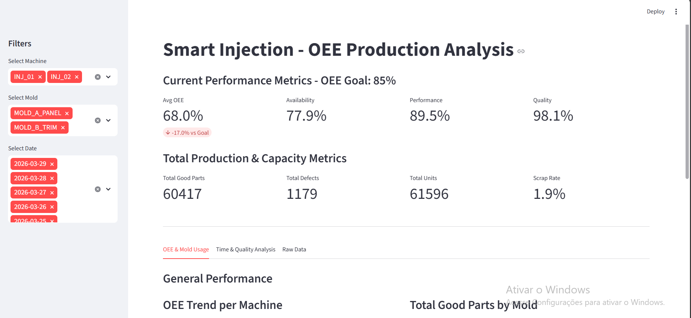
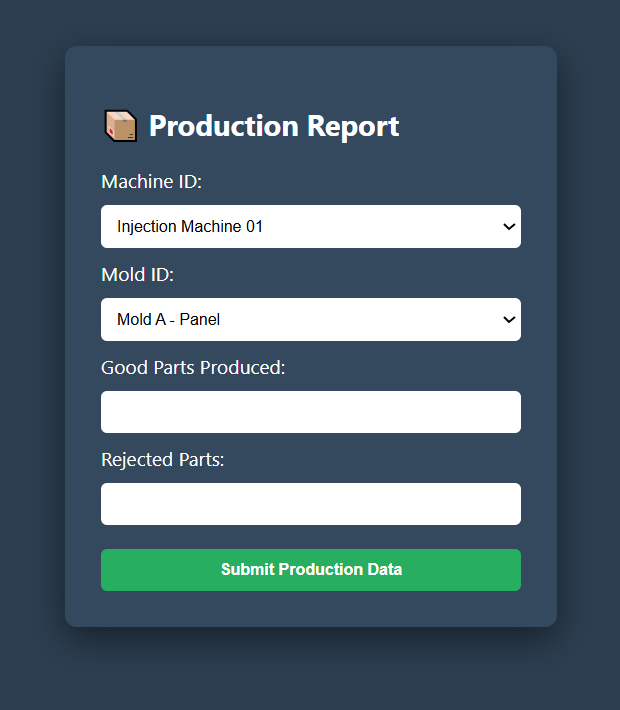
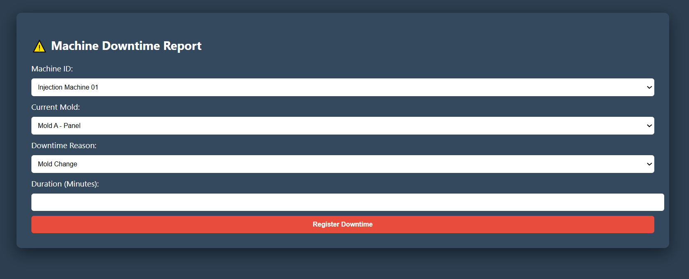

# Smart Injection - Full-Stack OEE System

A comprehensive industrial IoT solution for monitoring **Overall Equipment Effectiveness (OEE)** in real-time. This project bridges the gap between shop-floor data collection and executive-level decision-making.

  

  
  
  
  

| Component | Tech | Description |
| :--- | :--- | :--- |
| **[Frontend]** |  | Interface de apontamento para os operadores. |
| **[Processing]** |  | Engine de cálculo de OEE com Numpy/Pandas. |
| **[Database]** |  | Armazenamento relacional em nuvem (PostgreSQL). |
| **[Dashboard]** |  | Visualização de KPIs e análise de qualidade. |

---

🎯 **The Challenge: Digital Transformation in Injection Molding**
In high-volume plastic injection environments, performance tracking is often fragmented, manual, and prone to data silos. This project was engineered to solve three critical operational bottlenecks:

1. **Complex OEE Calculation:** Traditional methods struggle with "Fair OEE" when machines switch molds mid-shift. I implemented logic to dynamically recalculate availability and performance based on specific mold/machine cycle times.

2. **Data Modernization (Legacy to Cloud):** Transitioning from error-prone paper logs and isolated spreadsheets to a centralized, **Cloud-backed SQL architecture (Supabase)**, ensuring a "single source of truth."

3. **Granular Traceability:** Establishing a relational link between downtime events and specific mold/machine pairs to identify hidden patterns in equipment failure or mold wear.

## 🛠️ Tech Stack
- **Frontend:** PHP (Data Entry Forms for Operators).
- **Database:** Supabase / PostgreSQL (Cloud relational storage).
- **Processing:** Python (Pandas/NumPy for OEE math and data engineering).
- **Visualization:** Streamlit (Business Intelligence Dashboard).
- **Infrastructure:** Docker & Docker-Compose.

## 🚀 Project Structure
- `/app_php`: PHP forms for registering production and downtime.
- `/scripts_python`: The "brain" of the project—handles OEE calculations and data processing.
- `/dashboard`: The interactive Streamlit dashboard.
- `/database`: SQL initialization scripts.
- `/dashboard_images`: Visual assets and performance screenshots.

## 📸 Screenshots

  
  
  
  

## 📝 Operator Interface (Data Entry)
To ensure data integrity, I developed dedicated PHP forms for shop-floor operators. These forms allow for real-time reporting of production output and downtime reasons, directly feeding the Supabase database.

  
  

## ⚙️ How to Run
1. **Infrastructure:** Run `docker-compose up -d` to start the Database and PHP forms.
2. **Install Dependencies:** `pip install -r requirements.txt`
3. **Run Processing:** `python scripts_python/compute_oee.py`
4. **Launch Dashboard:** `streamlit run dashboard/dashboard.py`

---
**Author:** [Ricardo Serenato Junior](https://www.linkedin.com/in/ricardoserenatojr/)