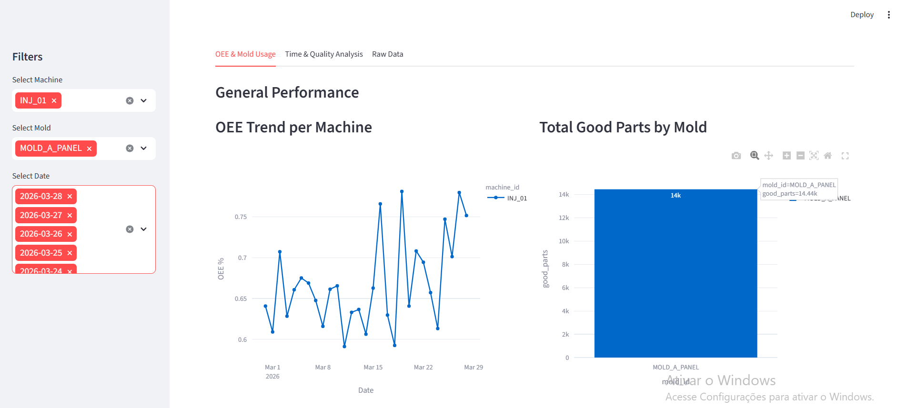
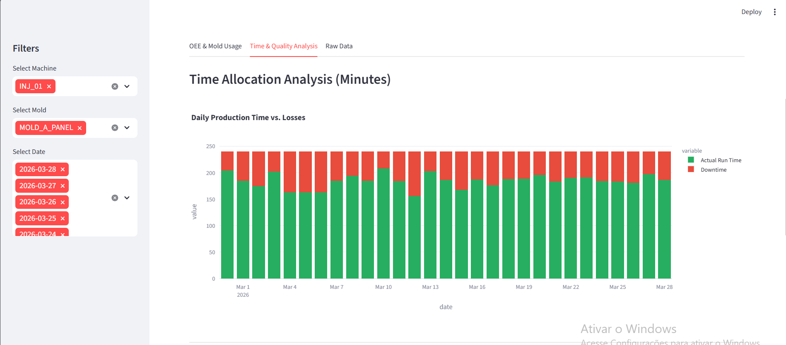
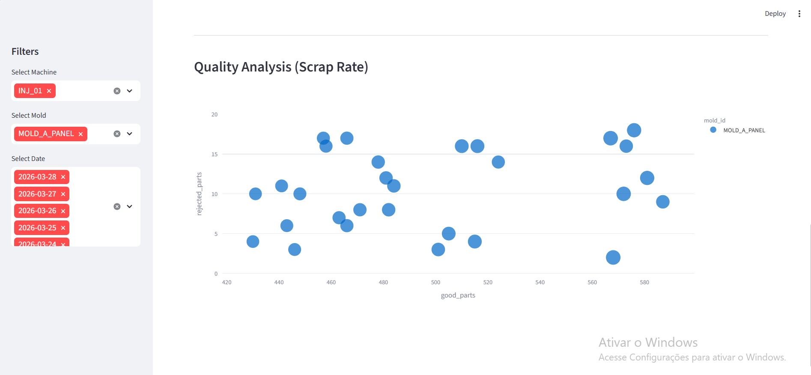

# Smart Injection - Full-Stack OEE System

A comprehensive industrial IoT solution for monitoring **Overall Equipment Effectiveness (OEE)** in real-time. This project bridges the gap between shop-floor data collection and executive-level decision-making.

  

  
  
  
  

| Component | Tech | Description |
| :--- | :--- | :--- |
| **[Frontend]** |  | Interface de apontamento para os operadores. |
| **[Processing]** |  | Engine de cálculo de OEE com Numpy/Pandas. |
| **[Database]** |  | Armazenamento relacional via Docker. |
| **[Dashboard]** |  | Visualização de KPIs e análise de qualidade. |

---

## 🎯 The Challenge
In plastic injection molding, tracking performance is often manual and prone to errors. This project solves three main issues:
1. **Dynamic Mold Allocation:** Calculating OEE fairly when machines switch molds mid-shift.
2. **Real-Time Visibility:** Moving away from paper logs to a digital SQL-backed system.
3. **Traceability:** Correlating downtime events directly with specific mold/machine pairs.

## 🛠️ Tech Stack
- **Frontend:** PHP (Data Entry Forms for Operators).
- **Database:** PostgreSQL (Relational storage via Docker).
- **Processing:** Python (Pandas/NumPy for OEE math and data engineering).
- **Visualization:** Streamlit (Business Intelligence Dashboard).
- **Infrastructure:** Docker & Docker-Compose.

## 🚀 Project Structure
- `/app_php`: PHP forms for registering production and downtime.
- `/scripts_python`: The "brain" of the project—handles OEE calculations and data processing.
- `/dashboard`: The interactive Streamlit dashboard.
- `/database`: SQL initialization scripts.
- `/dashboard_images`: Visual assets and performance screenshots.

## 🧮 The "Smart" Logic: OEE Calculation
Unlike basic OEE calculators, this system uses **Dynamic Loading Time**.
If a machine runs multiple molds in a 480-minute shift, the system automatically redistributes the available time based on the number of molds used:

$$\text{Allocated Time} = \frac{480 \text{ min}}{\text{Number of Molds per Day}}$$

This ensures that a mold used for only 2 hours isn't penalized with 8 hours of availability loss.

## 📸 Screenshots

  
  
  
  

## ⚙️ How to Run
1. **Infrastructure:** Run `docker-compose up -d` to start the Database and PHP forms.
2. **Install Dependencies:** `pip install -r requirements.txt`
3. **Run Processing:** `python scripts_python/compute_oee.py`
4. **Launch Dashboard:** `streamlit run dashboard/dashboard.py`

---
**Author:** Ricardo Serenato Junior  